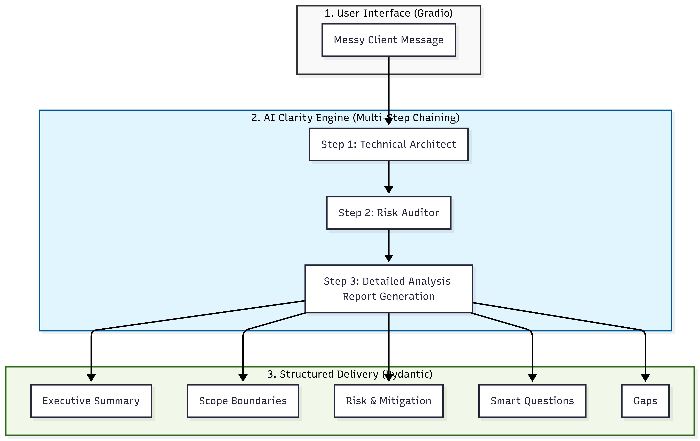

# 🚀 FlowixPro: The Freelancer's "Clarity Engine"

**Transform messy client chaos into crystal-clear project plans in seconds.**

[](https://www.python.org/downloads/)
[](https://opensource.org/licenses/MIT)

---

## 😫 The Problem
Every freelancer has been there: A client sends a 10-minute voice note, a chaotic WhatsApp message, or a vague email saying, *"I want a website like Amazon but simple and cheap."* 

This leads to:
- **Scope Creep**: Doing work you never agreed to.
- **Budget Mismatches**: Realizing too late that the client's budget is 1/10th of the actual cost.
- **Vague Requirements**: Losing days to back-and-forth emails.

## ✨ The Solution: FlowixPro
FlowixPro is a sophisticated AI orchestration engine that acts as your **Senior Project Manager**. It uses a multi-step "Expert Chain" to decode messy messages and deliver instant clarity.

### 🛠️ Killer Features
- **🔍 Specialized Analysis Modes**: 
    - **Summary**: Deciphers the client's actual intent.
    - **Scope**: Defines strict technical boundaries.
    - **Risks**: A ruthless audit of technical, budget, and timeline red flags.
    - **Gaps**: Highlights exactly what info you're missing before you can quote.
    - **Questions**: Generates strategic questions to win the deal.
- **🧠 Expert Chaining**: Uses specialized AI personas (Architect, Auditor, PM) for 3x higher accuracy than standard chatbots.
- **🛡️ Risk Mitigation**: Doesn't just find problems—it suggests professional strategies to handle them.

---

## 🏗️ How it Works (System Architecture)
FlowixPro isn't just a wrapper. It's a structured intelligence pipeline built on **Sequential Chaining**:



### The Intelligence Layers:
1.  **User Layer**: Capture the client's "chaos" and your analysis preference.
2.  **Intelligence Layer**: Employs **Sequential Expert Chaining**. The Architect decodes intent, the Auditor scans for risks, and the PM synthesizes the final professional plan.
3.  **Data Layer**: Uses **Pydantic Enforcement** to ensure the AI output is 100% reliable and structured.

---

## 🛠️ Technology Stack
- **Core Intelligence**: OpenAI GPT-4o-mini
- **Orchestration**: LangChain / LlamaIndex
- **UI Framework**: Gradio / Streamlit
- **Reliability**: Pydantic V2 (Strict Type Enforcement)

---

## 🚀 Quick Start

### 1. Installation
```bash
git clone https://github.com/iammawaistariq/Freelancer-Clarity-Engine.git
cd Freelancer-Clarity-Engine
pip install -r requirements.txt
```

### 2. Configuration
Create a `.env` file and add your OpenAI API Key:
```env
OPENAI_API_KEY=your_api_key_here
```

### 3. Run
```bash
python app.py
```

---
*Built to help freelancers respond faster, avoid confusion, and never lose a deal to unclear requirements again.*
